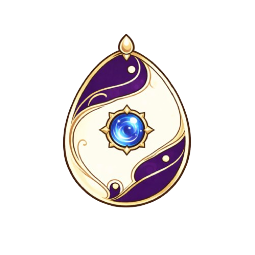
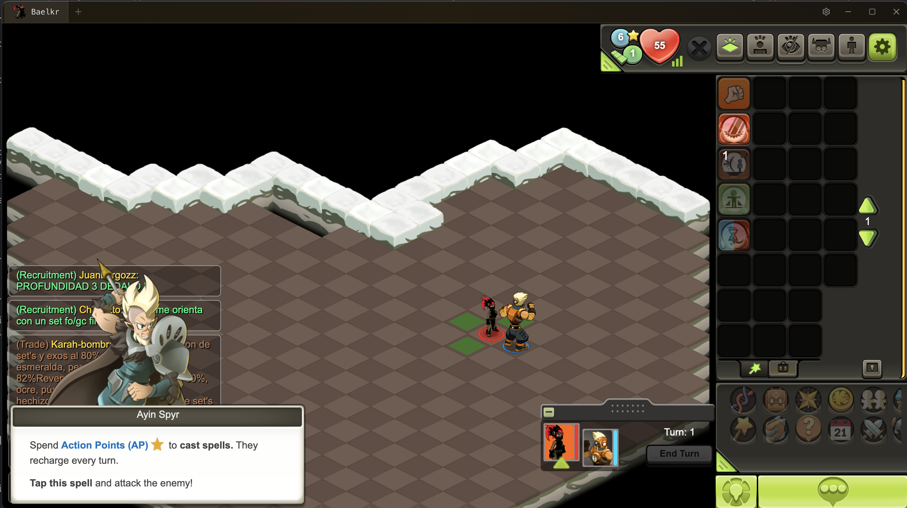

<p align="center">
  
</p>

<h1 align="center">DofEmu</h1>

[](https://github.com/angine67/DofuEmu/releases)
[](https://nodejs.org)

Unofficial desktop client for Dofus Touch.



## Features

- Multi-account with up to 5 tabs
- Team management with leader/follower roles
- Auto-group — followers auto-follow across maps
- Auto-invite — automatic party invitations
- Drag-to-reorder tabs
- Character icon capture in tabs
- Configurable hotkeys
- Audio mute / sound-on-focus
- Proxy support (HTTP, HTTPS, SOCKS5)
- Auto-download and patch game files on startup
- Persistent settings via electron-store

## Download

Grab the latest release from the [Releases](https://github.com/angine67/DofuEmu/releases) page.

| Platform | Format |
|----------|--------|
| macOS | `.dmg` |
| Windows | `.exe` (NSIS installer) |
| Linux | `.AppImage` |

## Development

```bash
pnpm install
pnpm run dev
```

## Build

```bash
pnpm run build
pnpm run dist
```

## Stack

| Layer | Tech |
|-------|------|
| Shell | Electron |
| UI | React 19, TypeScript |
| Build | Vite |
| State | Zustand |
| Server | Hono |
| Storage | electron-store |

## Project Structure

```
packages/
  main/           Electron main process
    windows/      BrowserWindow management
    updater/      Game downloader + patcher
    game-base/    Game shell, CSS fixes, regex patches
    scripts/      Injected helper scripts
  renderer/       React frontend
    screens/      GameScreen, SetupScreen, SettingsScreen
    stores/       Zustand stores (tabs, teams, settings)
    mods/         Game mods (auto-group, party invite)
    components/   Shared components
    utils/        Utilities
  preload/        Electron preload bridge
  shared/         Shared types and constants
```

## License

GPL-3.0
